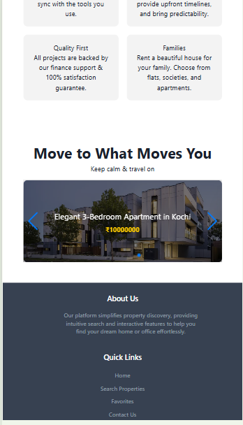

# Design-Daredevils_052
# Dreamhouse.com 🏠

## Overview
Dreamhouse.com is a property listing website where users can find homes ranging from budget-friendly to luxury prices. It provides a seamless experience for users to browse properties and for admins to manage listings.

## Features
- 🔹 **User Authentication**: Login and registration system using Firebase.
- 🔹 **Admin Dashboard**: Only admins can add, edit, or delete properties.
- 🔹 **Property Listings**: View properties with details like price, location, and images.
- 🔹 **Single Property Page**: Displays detailed information about a selected property.
- 🔹 **Search & Filter**: Users can find properties based on price range.
- 🔹 **Protected Pages**: Some pages require login access.
- 🔹 **Map Integration**: Helps users find property locations easily.
- 🔹 **Backend**: JSON Server is used to manage API requests.
- 🔹 **Fully Responsive**: Optimized for all devices.

## Technologies Used
- **Frontend**: HTML, CSS, JavaScript, React (if applicable)
- **Styling**: Tailwind CSS, Chakra UI, Font Awesome
- **Backend**: JSON Server for API management
- **Authentication**: Firebase
- **Map API**: (Specify if you used Google Maps, Leaflet, etc.)
- **Hosting**: (If deployed, mention where—Netlify, Vercel, Firebase Hosting, etc.)

## Team Members & Contributions
- **Vibha Maurya (Team Lead)**
  - Developed **Login & Register** functionality.
  - Created **Navbar** and **Admin Dashboard**.

- **Shivam Kumar Singh**
  - Built **Home Page** and **Single Property Page**.
  - Implemented **Protected Routes** (pages that require login access).
  - Managed **Admin Functionality**.
  - Designed **Responsive Layout**.
  - **Merged all files** and connected different pages.
  - Wrote this **README.md** file.

- **Jay Kumar Dohare**
  - Developed **Property Listing Page**.
  - Implemented **Search & Filter Functionality**.
  - Worked on **Responsive Design**.

## Installation & Setup
```bash
# Clone the repository
git clone `https://github.com/vibhamaurya060/Design-Daredevils_052.git`
cd Design-Daredevils_052

# Install dependencies
npm install

# Start JSON Server
json-server --watch db.json --port 3001

# Run the frontend
npm run dev
```

## Admin Access

```
- **Admin_1**
      - UserName:- Shivam Singh
      - Password:- Shi@123
- **Admin_2**
      - UserName:- Vibha Maurya
      - Password:- Vibha@123
- **Admin_3**
      - UserName:- Jay
      - Password:- Jay@123

```
### Diployment

- Live_Link:- 

# ScreenShoot:- 
## 1. Responsive:-
- For Laptop
  


- For iPad
  


- For Mobile
  


## 2. WebSite OverView:-

- User SignUp


- User Login


- Home Page


- Property Listing Page


- Admin Login


- Admin DashBoard
  


### 🛠 Built with ❤️ by Vibha Maurya, Shivam Kumar Singh & jay kumar dohare
```
libraries are properly mentioned in the README. Let me know if you need any more changes! 🚀
```
